# Learn to Invest

An interactive web app that teaches stock investing **from absolute zero** — and lets you practice
everything immediately in a built-in paper-trading simulator with virtual money, alongside an AI
mentor that plays the role of a senior investment analyst.

No backend, no accounts, no real money at risk. Everything runs in your browser.

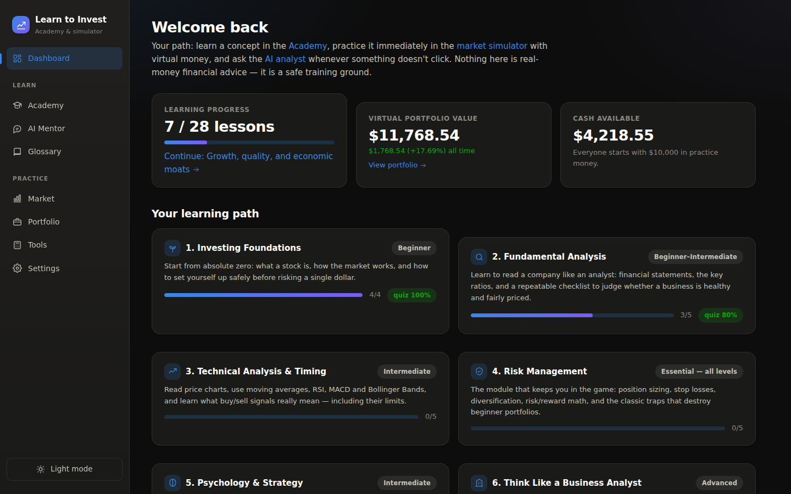

---

## Contents

- [Investing Academy](#investing-academy) — 12 modules, 73 lessons, quizzes
- [Indicator reference](#indicator-reference) — all 17 indicators, drawn and explained
- [Pattern lab](#pattern-lab) — back-test 22 signals against their own baseline
- [AI Mentor](#ai-mentor) — chat with a senior analyst about your own portfolio
- [My investments](#my-investments) — track your real holdings, with live charts and analyst reads
- [Research](#research) — one company under the microscope, on a shared comparison chart
- [Market simulator](#market-simulator) — TradingView candlestick charts, indicators, fundamentals
- [Paper trading](#paper-trading) — a virtual $10,000 portfolio with risk feedback
- [Analyst tools](#analyst-tools) — position sizing, risk/reward, compounding, DCF
- [Live market data](#optional-live-market-data) (optional)
- [Running it](#running-it) · [Deploying](#deploying-to-github-pages) · [License](#license)

---

## Investing Academy

Twelve modules and 73 lessons that take you from "what is a stock?" to writing professional
investment theses — modelled on the arc of full investing curricula: foundations → concepts →
analysis → charts → timing → events → risk → decisions → psychology. Each module ends with a
quiz, and your progress is saved locally.

| # | Module | What you learn |
|---|--------|----------------|
| 1 | **Investing Foundations** | What a stock is, how markets and orders work, and how to set yourself up safely before risking a dollar |
| 2 | **Financial Concepts** *(basic → advanced)* | Time value of money and compounding, inflation and real returns, interest rates and the economic cycle, bonds and the yield curve, the mathematics of risk (volatility, correlation, beta, CAPM, Sharpe), cost of capital and WACC vs ROIC, instruments from ETFs to options, leverage and short selling, and the retail leverage shelf — knockouts, warrants and factor certificates — with the arithmetic of why the house usually wins |
| 3 | **Fundamental Analysis** | The three financial statements, valuation ratios (P/E, P/S), health ratios, moats, and a repeatable analysis checklist |
| 4 | **Reading Charts from Zero** | What a chart actually records, how a candlestick is built from four prices, timeframes and aggregation, volume as a conviction meter, log scales / gaps / adjusted prices, and a repeatable five-step chart read |
| 5 | **Technical Analysis & Timing** | Trends and support/resistance, moving averages, the four families of indicators, oscillators compared, trend strength with ADX, volatility and volume tools, building a non-redundant indicator set, and honest buy/sell signals |
| 6 | **Prediction & Pattern Recognition** | Whether prices can be predicted at all, base rates, chart and candlestick patterns, seasonality and calendar effects, the traps that make a back-test lie, and thinking in probabilities |
| 7 | **Company Events & the Big Picture** | Earnings reports and the expectations game, dividends and buybacks, splits / IPOs / spin-offs and other corporate actions, the economic data that moves whole markets, sector rotation across the cycle, and surviving bear markets |
| 8 | **Risk Management** | Position sizing (the 1–2% rule), stop losses, diversification, risk/reward math, and the traps that destroy beginners |
| 9 | **When to Buy, When to Sell** | Watchlists, the five-gate buy checklist, lump sum vs scaling in, recognising when a price has outrun the value, the broken-thesis checklist, the exit playbook, and holding as a skill |
| 10 | **Crypto: A Different Asset Class** *(elective)* | What a cryptocurrency actually is, the root differences from stocks (no cash flows, no valuation anchor, no safety net), exchanges / wallets / custody and "not your keys, not your coins", analysing tokenomics honestly, satellite sizing with DCA and rebalancing, and the full risk-and-scam field guide |
| 11 | **Psychology & Strategy** | Behavioral biases, choosing a strategy, when to sell, and writing your own investment policy statement |
| 12 | **Think Like a Business Analyst** | Business models, unit economics, Porter's Five Forces, SWOT, moat durability, DCF valuation, and investment theses |

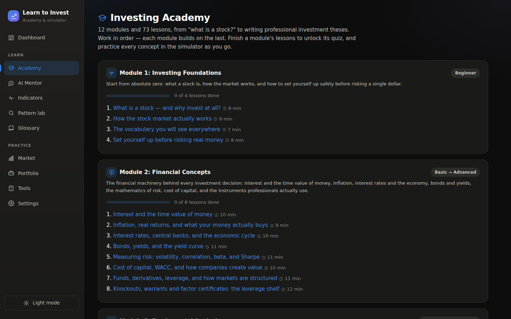

Lessons are written for a beginner — plain language, worked examples, and callouts for the things
that actually cost people money.

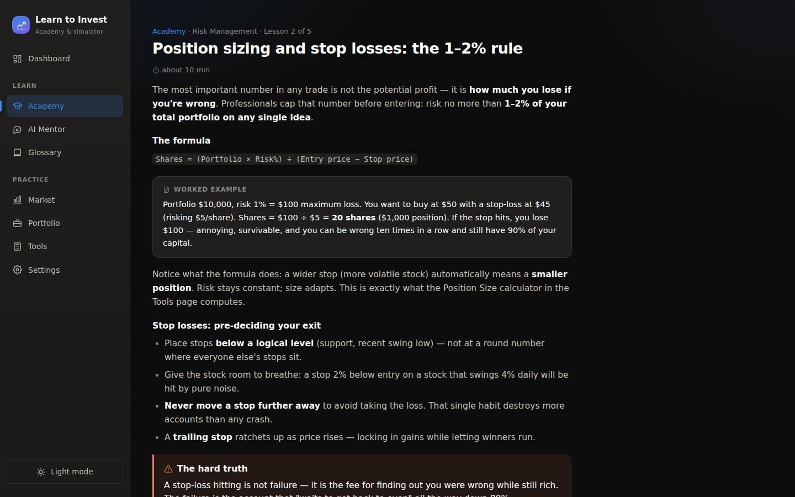

The Financial Concepts module runs from first principles to the machinery professionals actually use, so that concepts
like discounting, duration and cost of capital are already familiar when later modules rely on them.

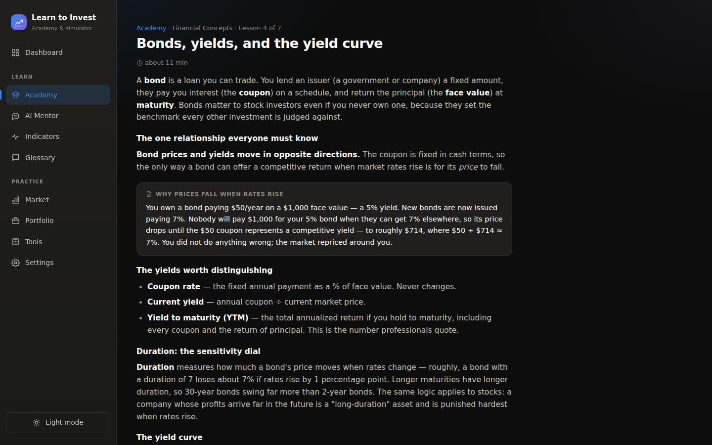

That module ends with a field guide to the leverage products modern broker apps put one tap away —
knockout certificates, warrants and factor certificates — what each one is, the arithmetic of
knockout barriers and volatility drag, and why the costs are structural rather than bad luck.

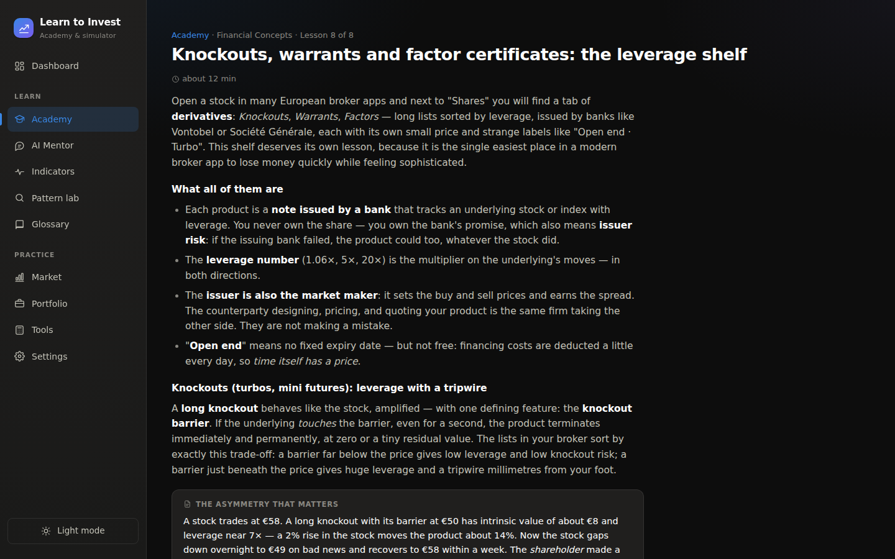

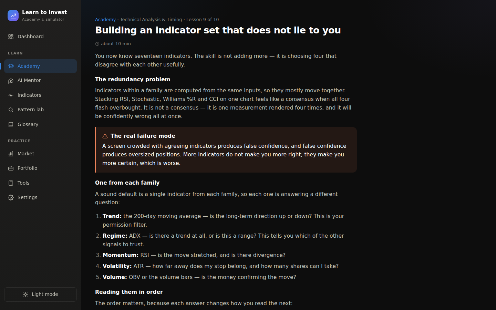

The prediction module turns the sceptical eye on prediction itself — and hands you the
[Pattern lab](#pattern-lab) to test any claim you are told. The chart-reading module teaches the
candlestick from scratch — how each bar is built from four prices, what timeframes and volume
mean, and a five-step routine for reading any chart. And the buy/sell module is the capstone:
watchlist → five buy gates → entry methods → overvaluation and broken-thesis checklists → the
exit playbook.

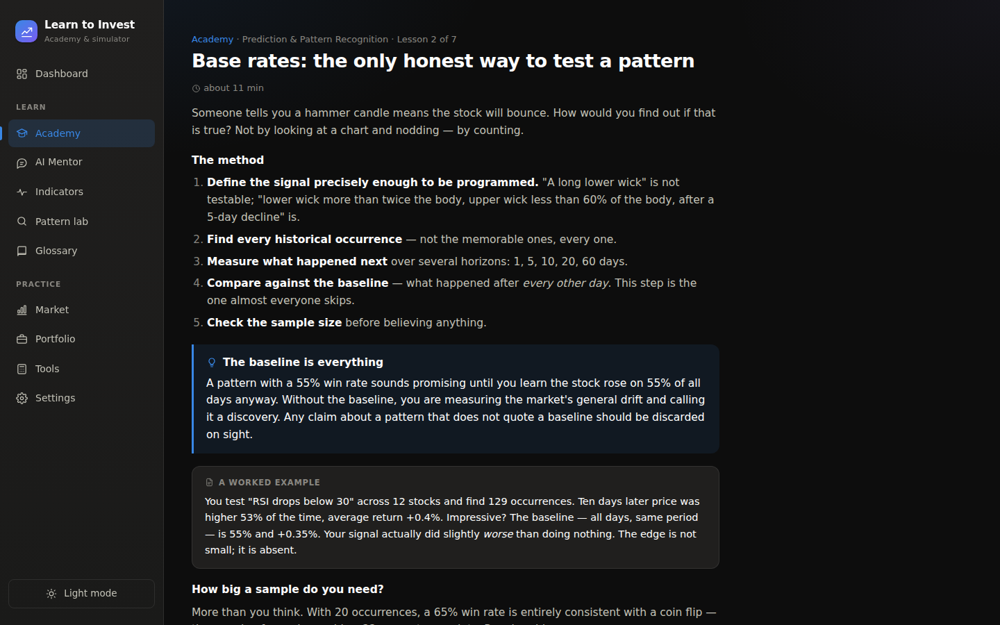

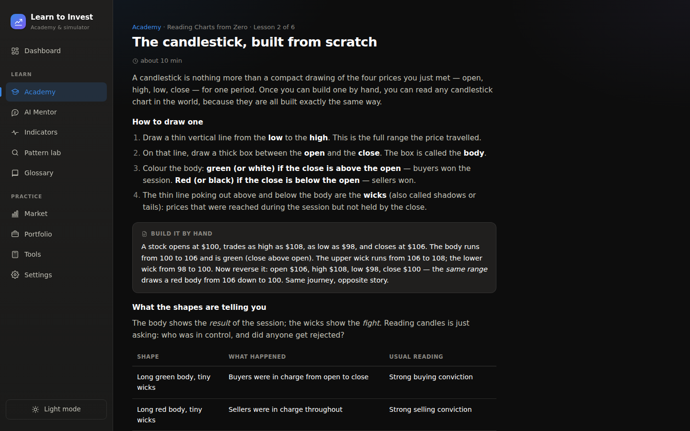

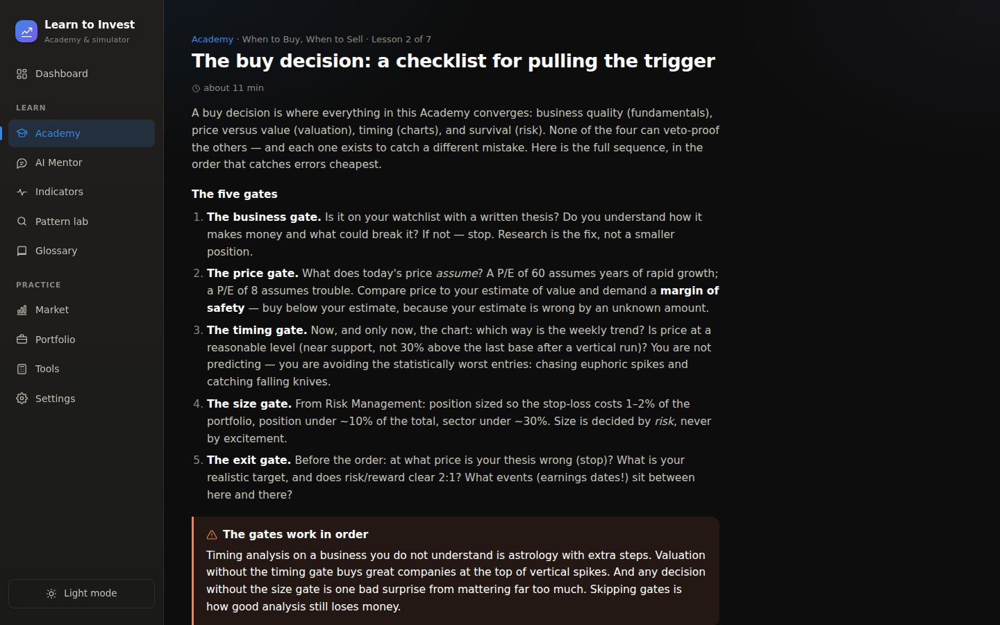

The crypto elective takes neither cult's side: it explains what the technology actually is, why
the absence of cash flows deletes most of the valuation toolkit, how custody and wrappers work,
and how to size a position — if any — so that crypto's routine 80% drawdowns are survivable.

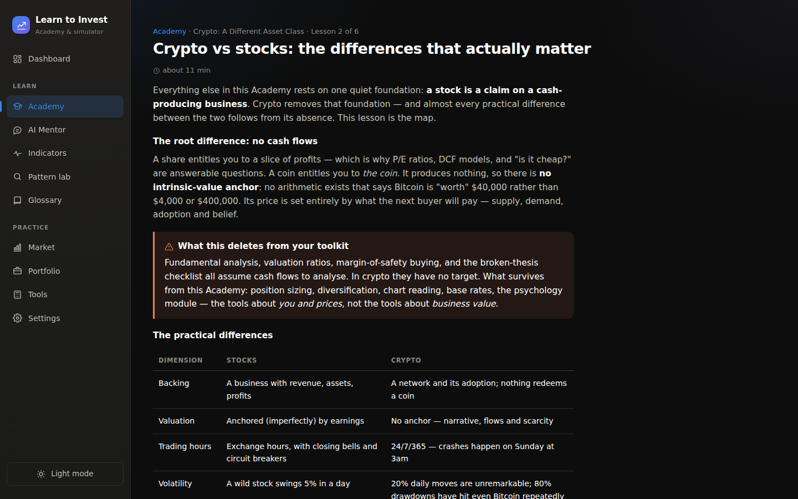

---

## Indicator reference

A dedicated page for learning indicators properly: **all 17 are drawn on real price data**, so you
can see exactly what each looks like before deciding whether it is useful to you.

Every indicator card gives you six things — what it measures, a live chart of it, **what it is
saying about that chart right now**, what its shape looks like in practice, how to read it, and
where it misleads you. Change the stock or the range and every reading recomputes.

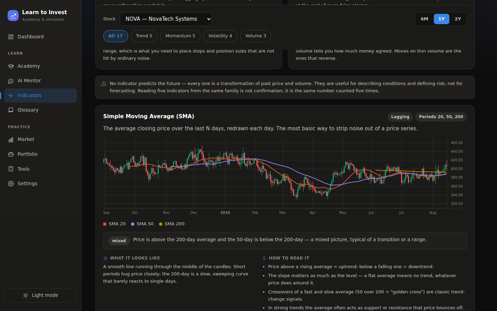

Indicators are grouped into the four families, with overlays drawn on the candles and oscillators
in their own pane, exactly as they appear on a real chart.

| Family | Question it answers | Indicators |
|---|---|---|
| **Trend** | Which way, and how strongly? | SMA · EMA/WMA · MACD · ADX + DI · Parabolic SAR |
| **Momentum** | How fast, and is speed fading? | RSI · Stochastic · Williams %R · CCI · ROC |
| **Volatility** | How much movement is normal? | Bollinger Bands · ATR · Keltner · Donchian |
| **Volume** | How much conviction is behind it? | OBV · MFI · VWAP |

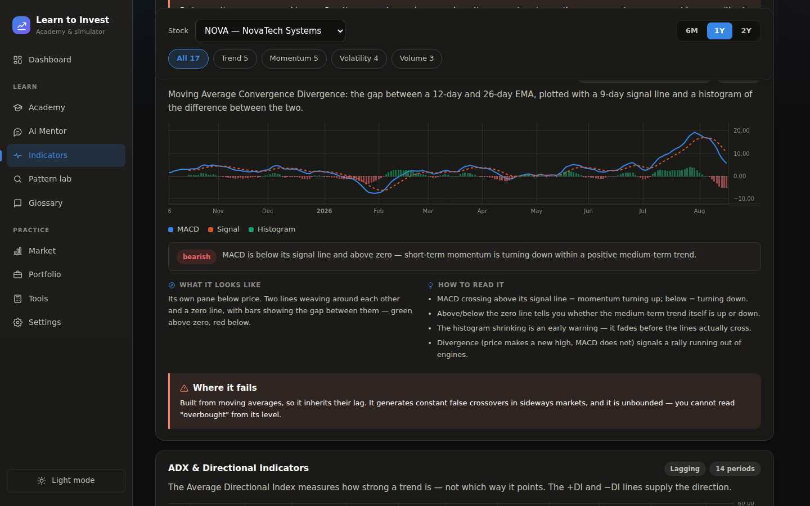

The page is deliberately honest about redundancy: Williams %R is mathematically the stochastic
minus 100, and stacking five momentum oscillators is one opinion counted five times, not
confirmation. The Technical Analysis module of the Academy teaches the theory and how to assemble a set of four
indicators that actually disagree with each other usefully.

---

## Pattern lab

The Academy teaches that most patterns are noise. The Pattern lab lets you **check that yourself**
instead of taking anyone's word for it.

Pick one of **22 signals** — candlestick patterns (engulfing, hammer, shooting star, doji, morning
and evening star, three white soldiers…), indicator conditions (RSI oversold, MACD cross, golden
cross, price crossing above the 200-day, Bollinger squeeze, ADX trend strength, new 52-week highs),
or calendar effects (Mondays, turn of the month, sell in May) — and it is back-tested across every
stock in the market.

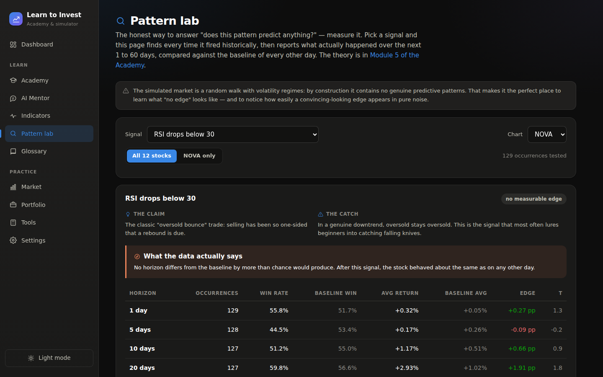

Every result is reported the honest way:

- **Forward returns at five horizons** — 1, 5, 10, 20 and 60 days after the signal.
- **Always against a baseline** — what happened after *all other* days. A 55% win rate means nothing
  if the stock rose on 55% of days anyway.
- **Sample size first** — under 30 occurrences the app refuses to draw a conclusion.
- **Significance *and* effect size** — a difference can be statistically real and still far too
  small to trade, and the verdict says so.
- **Every hit marked on the chart**, so you can see the ones that worked and the ones that didn't.

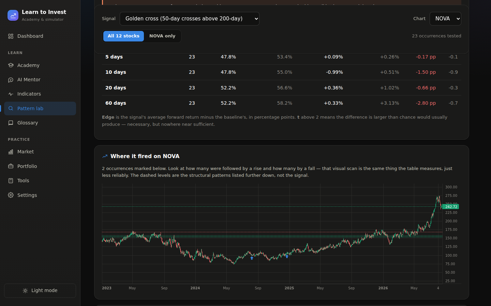

The market here is a random walk, so most signals correctly come back as "no edge" — which is the
lesson. The same discipline applied to real data is what separates analysis from pattern-matching.

---

## AI Mentor

Chat with an AI that plays a senior investment analyst. It explains concepts from scratch, walks
you through analyzing a company the way a professional would, reviews your practice portfolio for
risk, and quizzes you.

What makes it useful is context: the mentor sees **your** positions and P&L, the current market and
prices, and which lessons you have finished — so answers are about your situation, not generic
theory. From any stock page, **Ask the analyst about `<TICKER>`** opens the chat with that
company's price, indicators, and fundamentals already loaded.

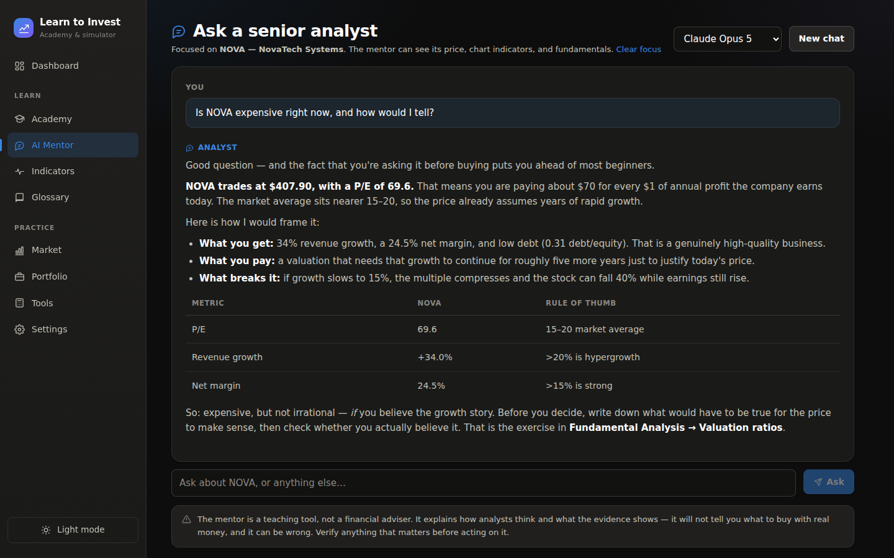

It is deliberately a *teacher*, not a tipster: it explains how analysts reason and what the
evidence supports, and declines to tell you what to buy with real money.

Requires your own [Claude API key](https://console.anthropic.com) — see
[Settings](#settings--api-keys).

---

## My investments

A dashboard for the portfolio you actually own — separate from the practice simulator, and
stored only in your browser like everything else.

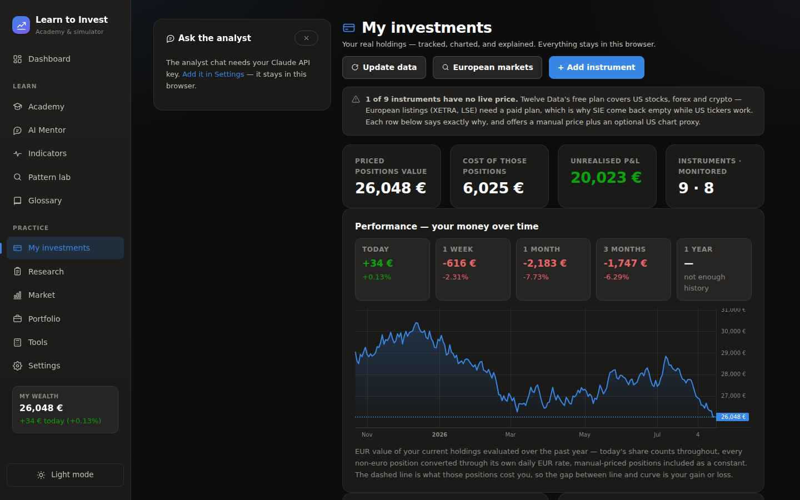

- **Your real instruments**, pre-seeded with an example mix of German stocks, a world ETF, US
  stocks and a private company — edit them, remove them, or **add any instrument** (stock, ETF, or
  private holding without a ticker).
- **Configure your position**: shares held, average cost, and a manual price for anything without
  a live feed (private companies, or exchanges outside your data plan).
- **Choose what to monitor** — monitored instruments get a live chart and analyst reads; the rest
  just sit in the table.
- **Live charts with selectable styles** — candles, line, area, or baseline, plus ranges, an
  SMA-50 overlay and a volume pane — via your Twelve Data key (US symbols work on the free plan;
  XETRA/LSE listings need a paid plan, and fall back to manual prices with a clear notice).
- **Analyst reads via the Claude API** — one click per holding produces a structured educational
  read: what the asset is, how it has been behaving, what an analyst would watch next, the risks
  of *your* position (including overlaps like owning Apple twice through a world ETF), and which
  Academy module to study next. Teaching, never buy/sell instructions.
- **A docked analyst chat on the left** that sees your real holdings and prices, so you can ask
  "am I too concentrated?" without leaving the dashboard.
- Totals are shown in EUR, with USD positions converted at the live EUR/USD rate.

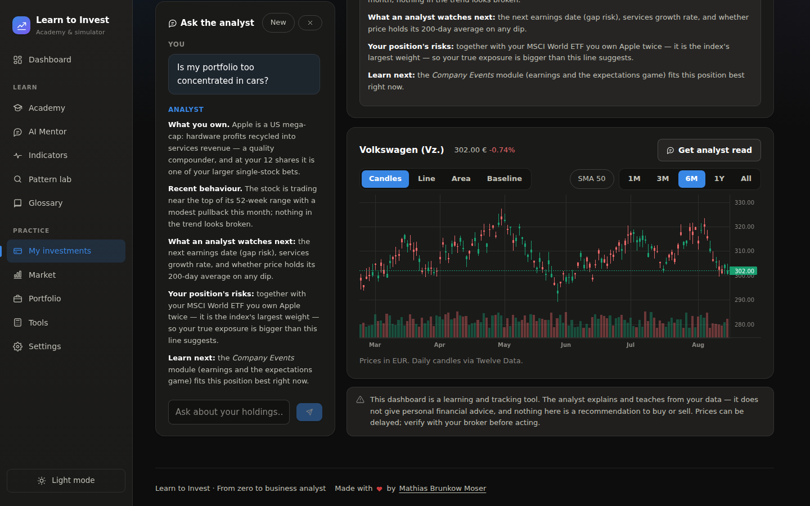

---

## Research

An interactive research dashboard built around one idea: **change the company you are researching,
and every panel follows — but the comparison chart is shared.** Companies you pin stay drawn on it
while you move between targets, so the side-by-side context survives the whole session (and a
reload).

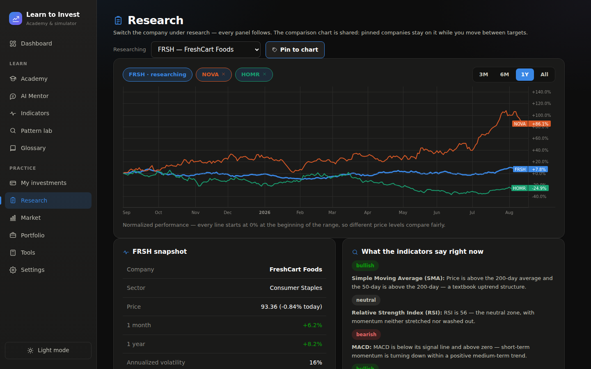

- **Shared normalized chart** — every line starts at 0% at the start of the range, so a $9 stock
  and a $400 stock compare fairly. Pin and unpin companies as chips; the researched one is drawn
  thicker.
- **Snapshot panel** — price, 1M/1Y performance, volatility, worst drawdown, position in the
  52-week range.
- **Live indicator readings** — SMA structure, RSI, MACD, ADX, ATR and OBV, each as a plain-English
  sentence with a bullish/bearish/neutral pill, recomputed for whichever company is selected.
- **Fundamentals & health score**, with jump links to the full chart page and to the AI mentor
  pre-focused on the company.
- **Relative performance table** for the researched company against everything pinned.
- **Per-company research notes** — the Academy's watchlist discipline made concrete: write the
  thesis, the price you'd pay, and what would change your mind; notes persist per ticker.
- **A research analyst chat docked on the right**, with an **"Analyse my situation"** button in the
  top-right corner: one click streams a structured read of everything on the dashboard — the
  researched company's numbers and indicator states, your pinned comparisons, your own notes, and
  your real portfolio — ending with concrete next steps and the Academy lesson that fills your
  biggest current gap. Tips and follow-up questions continue in the same chat.

---

## Market simulator

Twelve fictional companies across sectors, with deterministic price histories that advance every
real day.

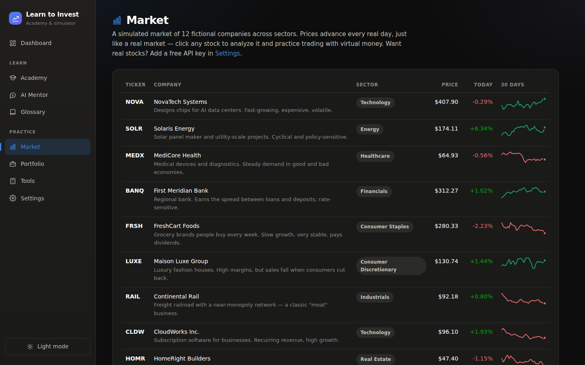

Charts are built on **[TradingView Lightweight Charts](https://github.com/tradingview/lightweight-charts)**
— the same charting engine used by professional finance sites. You get real candlesticks with a
volume pane, scroll-to-zoom and drag-to-pan, a crosshair with an OHLC readout, moving-average and
Bollinger overlays, and a candle/line toggle across five time ranges.

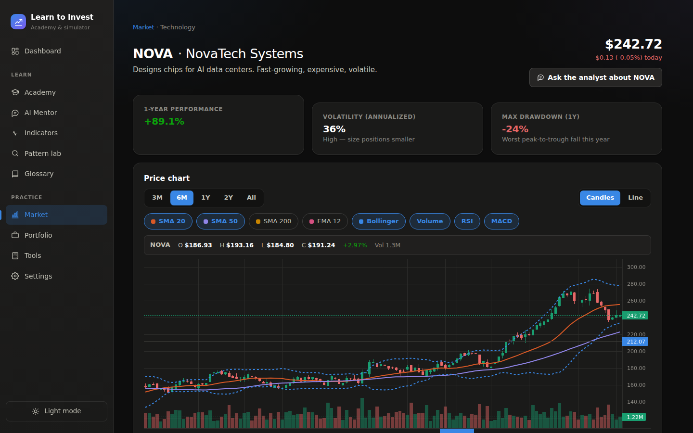

RSI and MACD open as separate panes whose crosshair and time axis stay locked to the price chart,
and every pane restyles itself when you switch theme.

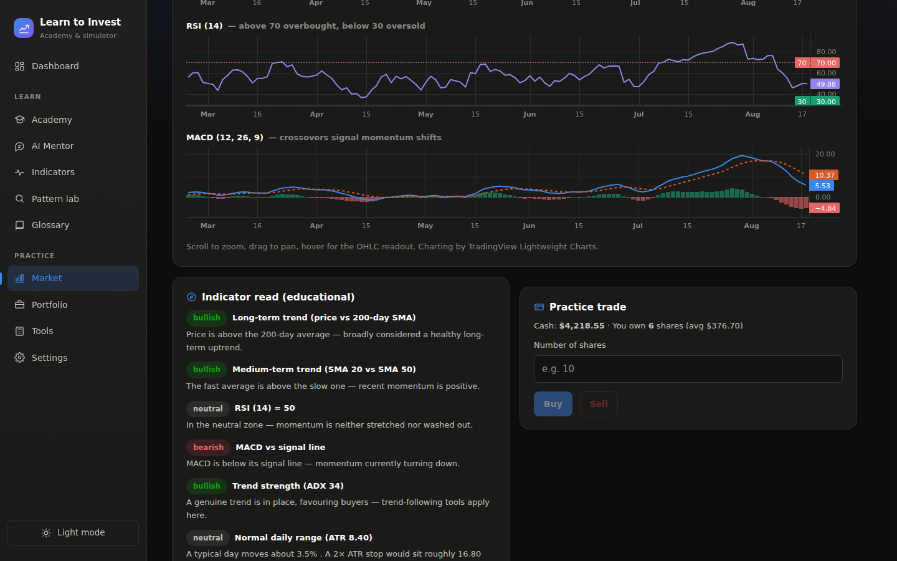

Below the chart, a plain-English read of what the indicators currently say — including whether ADX
says a trend even exists (and therefore which signals to trust), what a normal day's range means for
your stop, and whether volume is confirming the move — plus full fundamentals with beginner
explanations and a component-by-component financial health score.

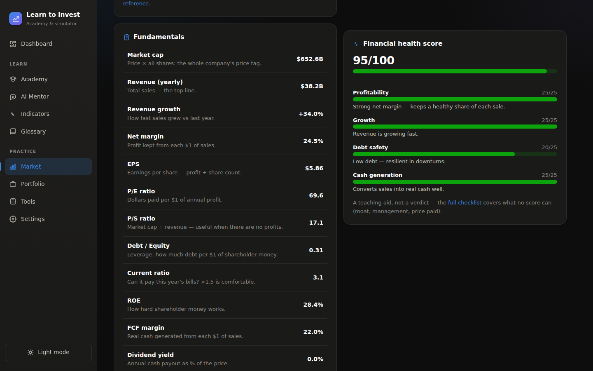

---

## Paper trading

Everyone starts with **$10,000 of virtual cash**. The portfolio page tracks positions, P&L,
allocation by stock and by sector, and full transaction history — plus automatic diversification
feedback that flags concentration the way a good advisor would.

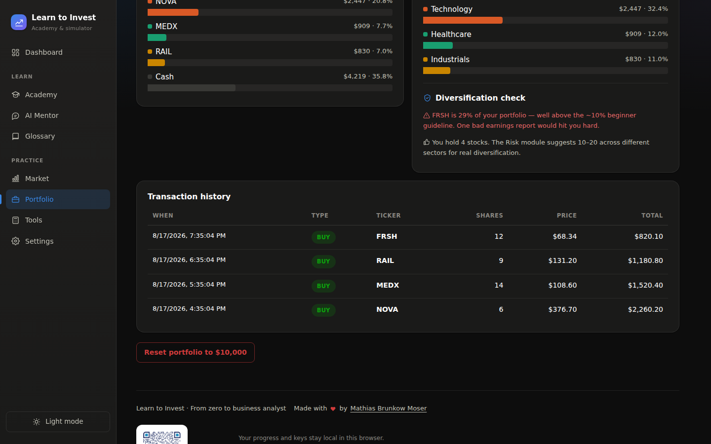

---

## Analyst tools

The four calculations the lessons keep coming back to: position sizing (the 1–2% rule),
risk/reward with the break-even win rate, compound growth, and a simplified DCF with margin of
safety.

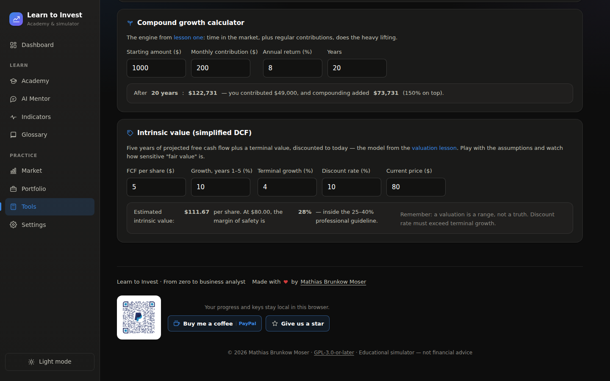

There's also a searchable 166-term glossary in plain English.

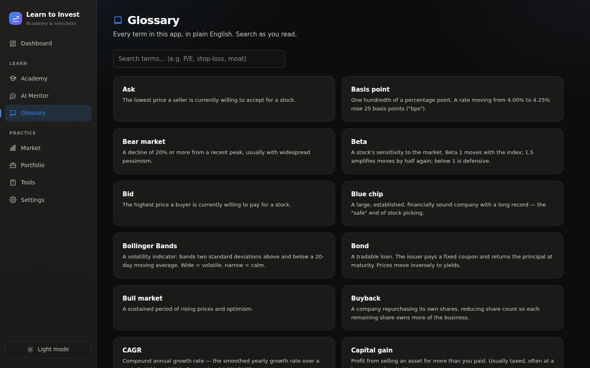

---

## Settings & API keys

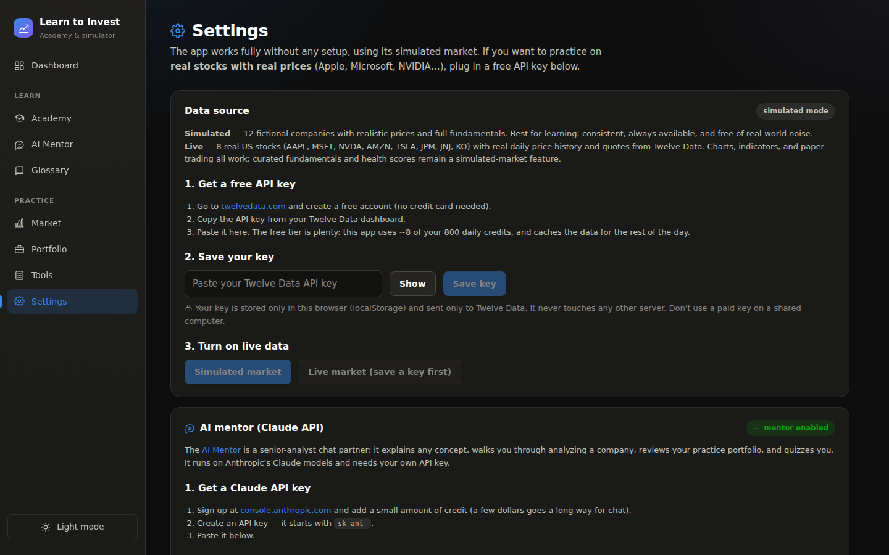

Two optional integrations, each using your own key, stored **only in your browser** and sent only
to its own provider:

### AI Mentor — Claude API
Create a key at [console.anthropic.com](https://console.anthropic.com) and paste it into Settings.
Pick **Claude Opus 5** (deepest analysis), **Sonnet 5** (balanced), or **Haiku 4.5** (fastest and
cheapest). Replies stream in as they are written.

### Optional live market data — Twelve Data
Paste a free [Twelve Data](https://twelvedata.com) key to switch the Market from the simulated
companies to **8 real US stocks** (AAPL, MSFT, NVDA, AMZN, TSLA, JPM, JNJ, KO) with real daily
price history. Charts, indicators, and paper trading all work on real data. One batch request per
day (~8 of the free tier's 800 daily credits), cached until midnight; if the fetch fails the app
says why and falls back to the simulated market.

> **Security note:** the app has no server, so both keys live in the browser's localStorage. That
> is fine for personal use — but use keys with spending limits, and don't save them on a shared
> computer. A multi-user deployment should proxy these calls server-side.

---

## Themes

Dark by default, with a light theme one click away in the sidebar.

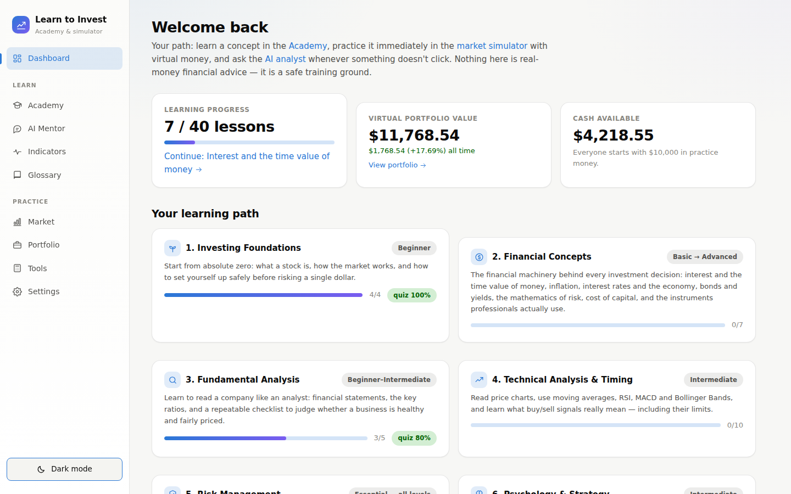

---

## Running it

```bash
npm install
npm run dev      # development server
npm run build    # production build to dist/
npm run preview  # serve the production build
```

Built with React + Vite, charting by
[TradingView Lightweight Charts](https://github.com/tradingview/lightweight-charts) (Apache-2.0),
and the AI mentor on the official [Anthropic SDK](https://github.com/anthropics/anthropic-sdk-typescript).
All state — course progress, portfolio, settings, and chat history — lives in your browser's
localStorage.

## Deploying to GitHub Pages

`.github/workflows/deploy.yml` builds and publishes the app on every push to `master`. One-time
setup: in the GitHub repo go to **Settings → Pages** and set **Source: GitHub Actions**. The app
uses hash routing and relative asset paths, so it works on Pages with no extra configuration.

---

## Disclaimer

This is an educational simulator. In simulated mode all companies, prices, and financial data are
fictional and generated for practice; in live mode the prices are real but the portfolio is still
virtual. Nothing in this app is financial advice.

---

## Support the project

If this project helps you learn to invest, you can
[buy me a coffee with PayPal](https://paypal.me/mathiasbrunkowmoser).

<a href="https://paypal.me/mathiasbrunkowmoser">
  
</a>

Made with ♥ by [Mathias Brunkow Moser](https://github.com/matbmoser).

---

## License

GPL-3.0-or-later — see [LICENSE](LICENSE).

This program is free software: you can redistribute it and/or modify it under the terms of the GNU
General Public License as published by the Free Software Foundation, either version 3 of the
License, or (at your option) any later version. It is distributed in the hope that it will be
useful, but WITHOUT ANY WARRANTY; without even the implied warranty of MERCHANTABILITY or FITNESS
FOR A PARTICULAR PURPOSE.

## AI-generated content

The code and content in this repository were generated with AI assistance
(Claude Code, Anthropic), directed and edited by the author.

AI makes mistakes. Verify anything that matters — especially anything you would act on with real
money — against primary sources before relying on it.
